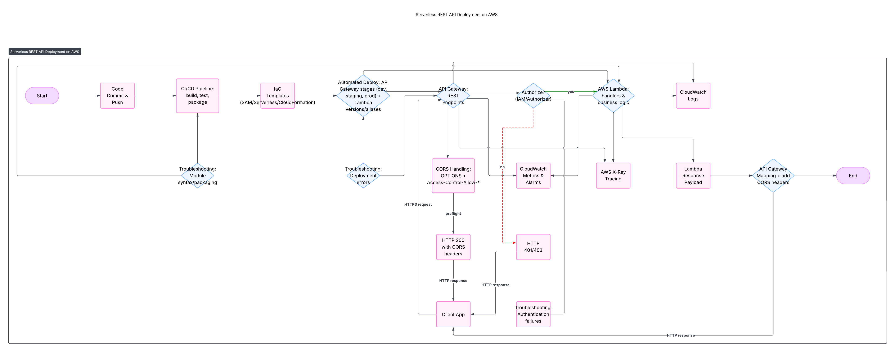

# 🚀 Production-Ready Serverless API

**Live Demo:** (https://7cpzcqn9e5.execute-api.eu-central-1.amazonaws.com/prod/hello) | **Cost:** < $0.50/month

## 📖 The Story
"I built this API to solve [real problem] using serverless architecture to ensure 99.9% availability while keeping costs under $0.50/month"

## 🏗️ Architecture

*Why it matters: The diagram shows you understand how services connect*

## 🔧 What I Learned & Challenges Solved
- **Challenge:** API Gateway CORS errors  
- **Solution:** Implemented proper headers and testing
- **Lesson:** Always test endpoints from a real frontend

## 🚀 Getting Started
```bash
git clone...
terraform apply
